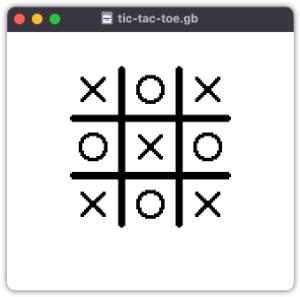

# GBDK - Tic-tac-toe

This is a basic Game Boy Tic-tac-toe game developed using [GBDK2020](https://github.com/gbdk-2020/gbdk-2020) (4.0.3).  

This is a work in progress, but technically, two players could use this to have a game of Tic-tac-toe. Movement and placement of marks has been implemented, but the game does not yet keep track of winner or loser, so the game won't stop when a match of 3 has been made.

If you're interested in *playing* the game, you can either compile the source code yourself, or download a pre-compiled ROM from the releases section.

## How to play

- Use arrows to move the mark
- Press `A` to place the mark
- Press `B` to clear the board
- Press `START + SELECT + A + B` to reset the game

---

## Build from source
Detailed instructions on how to set up the environment for any OS can be found inside the README file included with each version of gbdk dist archive or on their [docs page](https://gbdk-2020.github.io/gbdk-2020/docs/api/docs_getting_started.html#autotoc_md12).  

Basic instructions for Mac OS:

### Setup
1. Grab a copy of [gbdk-4.0.3](https://github.com/gbdk-2020/gbdk-2020/releases/tag/4.0.3) and extract it.
2. Inside the `Makefile` update the `GBDK_HOME` value to match the location of `gbdk/`.

### Build
1. Run `make` in cosnole.
2. Find the output, including the ROM, in `/obj`.

## Debugging
Detailed instructions can be found in [GBDK docs](https://gbdk-2020.github.io/gbdk-2020/docs/api/docs_links_and_tools.html#autotoc_md43).

Basic setup instructions for Emulicious + VS Code:

#### Setup
1. Download [Emulicious](https://emulicious.net/).
2. Install the [Emulicius Debugger](https://marketplace.visualstudio.com/items?itemName=emulicious.emulicious-debugger) extension for VS Code.
3. If necessary, adjust the `includePath` and `compilerPath` in `.vscode/c_cpp_properties.json` to point to `gbdk/`.

#### Launch
1. Run Emulicious.
2. Tick `Tools -> Remote Debugger -> Enable`.
3. In VS Code, under Run and Debug panel, run **Launch Emulicious**.

## To-do
- [ ] Prevent holding `A` from continuously placing marks
- [ ] Detect a victory
- [ ] Fade out the placed marks
- [ ] Add a game menu
- [ ] Add CPU for single player game
